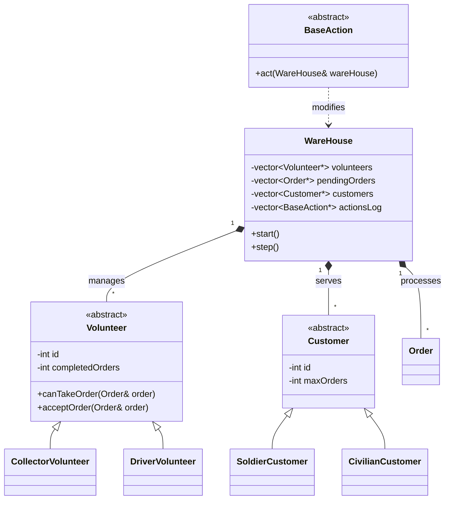

# 📦 Warehouse Management System


A comprehensive **C++ simulation** of a warehouse management system.
This project implements a robust backend for managing inventory, volunteers, customers, and orders using **Object-Oriented Programming** principles and strict **Memory Management** (Rule of 5).

---

## 🏗️ Architecture & Design

The system is built using the **Command Design Pattern**, where every user interaction is encapsulated as an `Action` object. The `WareHouse` class acts as the central controller, managing resources and game ticks.



### 🚀 Key Features
* **Polymorphism:** Diverse types of `Volunteers` (Collectors, Drivers) and `Customers` (Soldiers, Civilians) with unique behaviors.
* **Memory Safety:** Full implementation of the **Rule of 5** (Destructor, Copy Constructor, Copy Assignment, Move Constructor, Move Assignment) to prevent memory leaks.
* **Command Pattern:** User commands (`step`, `order`, `status`) are parsed and executed as polymorphic objects inheriting from `BaseAction`.

---

## ⚙️ Installation & Usage

### 1. Build the Project
Use the provided `makefile` to compile the source code.

### 2. Run the Simulation
The program requires a configuration file path as an argument.

### 3. Clean Up
To remove object files and the executable:

---

## 📝 Configuration File
The system initializes based on a text file defining the initial state (Customers and Volunteers).

**Example `configFile.txt`:**
```text
# Customer  <name>  <type>  <distance>  <max_orders>
customer    Maya    soldier 10          3
customer    Ben     civilian 2          5

# Volunteer <name>  <role>  <coolDown/maxDistance>
volunteer   Dan     collector 4
volunteer   Gal     driver  20          2
```

---

## 🕹️ Supported Commands
Once the simulation starts, you can use the following commands in the terminal:

| Command | Description |
| :--- | :--- |
| `step <n>` | Advance the simulation by *n* time units. |
| `order <id>` | Create a new order for a specific customer. |
| `customer <name> <type> ...` | Add a new customer dynamically. |
| `status` | Print the current status of all objects (Volunteers, Orders, Customers). |
| `log` | Print the history of actions performed. |
| `backup` | Save the current state of the warehouse. |
| `restore` | Load the warehouse state from the backup. |

---

### 👤 Author
**Yuval Tal & Michal Nudelman** - *Computer Science Students, BGU*
